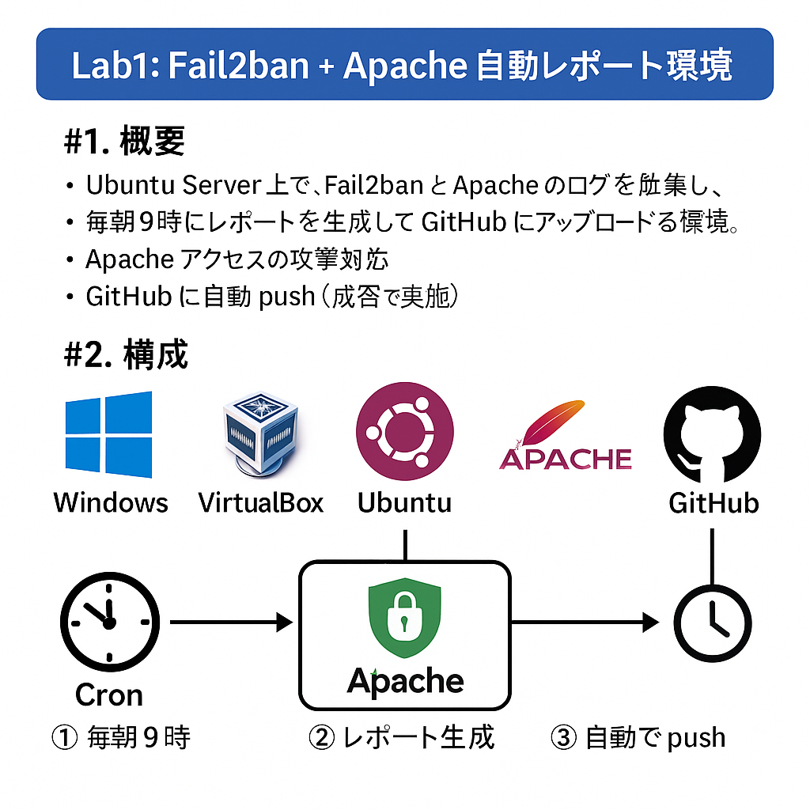

# Lab1: Fail2ban + Apache 自動レポート環境
## 📊 Lab1 構成図（Architecture）



## 1. 概要
Ubuntu Server 上で、Fail2ban と Apache のログを自動で集計し、
毎朝9時にレポートを生成して GitHub にアップロードするラボ環境。

## 2. 構成

- Ubuntu Server 24.04 (VirtualBox)
- Apache HTTP Server
- Fail2ban
- auto_security_report.sh（レポート自動生成）
- cron（毎朝9時に実行）
- GitHub（レポートの保存先）

## 3. このラボでできること

- SSH へのブルートフォース攻撃の検知（Fail2ban）
- Apache アクセスログの集計
- 毎日自動でレポート生成
- GitHub に自動 push（証跡として残せる）

---

## 4. セットアップ手順

### 4-1. 必要パッケージのインストール
```bash
sudo apt update
sudo apt install apache2 fail2ban -y
[sshd]
enabled = true
port    = ssh
filter  = sshd
logpath = /var/log/auth.log
maxretry = 5
bantime = 600
chmod +x auto_security_report.sh
crontab -e
# 以下を追加（パスは自分の環境に合わせて変更）
0 9 * * * /home/seiko/lab/bin/auto_security_report.sh
## 5. サンプル

- sample_report.md（自動生成レポートの例）
- cron_run_sample.log（cron の実行履歴の例）
- fail2ban_jail_sample.conf（Fail2ban 設定の抜粋）
- apache_access_sample.log（Apache アクセスログの抜粋）
